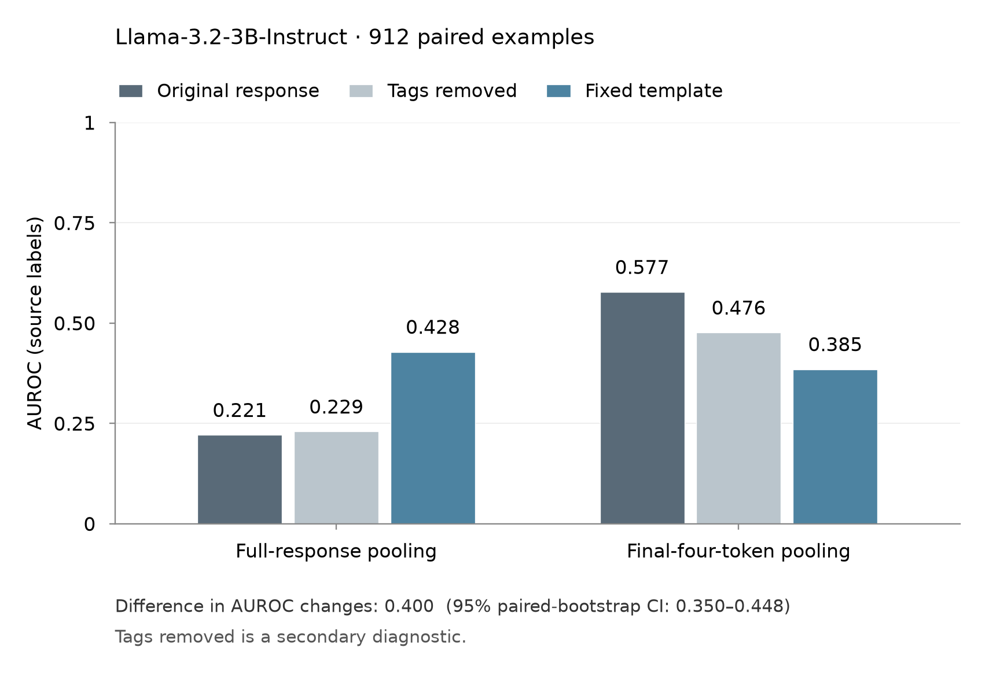

# Response pooling follow-up

This follow-up tests whether replacing a response with one fixed answer template changes source-label AUROC differently when the probe averages the whole response or only the last four response tokens. Each pooling rule has its own probe trained on role-playing responses.

## Results

Llama-3.2-3B-Instruct, 912 paired evaluation examples:

| Pooling | Original response | Fixed template | Change |
|---|---:|---:|---:|
| Whole response | 0.221 | 0.428 | +0.207 |
| Last four tokens | 0.577 | 0.385 | −0.192 |

The difference between these changes is **0.3996 AUROC**, with a paired-bootstrap 95% interval **[0.3502, 0.4482]**. This is not an accuracy improvement. Both fixed-template AUROCs remain below 0.5 in the original score direction.



The tags-removed bars are a secondary diagnostic on the same 912 examples. Their AUROCs are 0.229 for whole-response pooling and 0.476 for last-four-token pooling.

### Separate check after correcting training prefixes

The original extraction started a new assistant message where the training text should have continued an existing assistant prefix. After correcting this, AUROCs were 0.218 → 0.419 for whole-response pooling and 0.570 → 0.376 for last-four-token pooling. The difference between changes was **0.3954**, interval **[0.3466, 0.4440]**.

The corrected-minus-original difference was −0.0043, interval [−0.0153, 0.0071]. The observed direction pattern persisted; this does not establish zero effect or equivalence. This check was post hoc and does not replace the frozen analysis. Exact aggregate results are in [prefix-check-summary.json](prefix-check-summary.json).

## Scope

- One fixed template, with the answer near the end: wording, length, answer position and removal of the original explanation were not isolated.
- One confirmation model, held out from follow-up design and token-window selection; the model had appeared in the original study. Existing Apollo responses were reused.
- Labels describe the original responses, not deceptive intent expressed by the replacement sentence.
- Question source is strongly associated with the labels. A dataset-only score reaches AUROC 0.946; this does not establish that the probes used it.
- Intervals resample evaluation examples with fitted probes fixed. They do not cover retraining variability.
- This is a study of the local probe pipeline, not a successful replication of Apollo's detector. The original 0.9365 control missed the 0.94 threshold.

## What this release supports

The release contains the frozen analysis code, path-redacted result/protocol files, figure generation code, the prefix correction implementation and its tests, and aggregate corrected results. It does **not** contain saved activations or per-example scores. The checks below verify stored artifacts and code behavior; they do not independently recompute the bootstrap from evaluation scores.

The retained activations were independently compared during the private verification run. All original activation arrays matched exactly under reconstructed inputs with an explicitly fixed chat-template date. Historical token/kernel records were unavailable, so this did not recover every detail of the original execution.

## Run the checks

Use Python 3.11 and install the pinned analysis dependencies in a virtual environment:

```bash
python3.11 -m venv .venv
. .venv/bin/activate
pip install -r followup/frozen-analysis/requirements-release.txt
(cd followup/frozen-analysis && sh verify_release.sh)
python followup/render_figure.py
```

The frozen verifier checks all 22 manifest artifacts and regenerates the original report/figure. The separate renderer generates the grouped-bar figure used in the follow-up post from the frozen result JSON. The older figure stays inside the immutable frozen bundle for its hash check.

To inspect and test the prefix correction:

```bash
pip install torch==2.13.0 transformers==4.57.6 pytest==9.1.1
(cd followup/prefix-check-code && PYTHONDONTWRITEBYTECODE=1 PYTHONPATH=. python -m pytest -q tests/test_prefix_verification.py)
```

`prefix-check-code/p04/prefix_verification.py` implements the corrected continuation and date binding. Its extraction and analysis dependencies are included alongside it. These are implementation tests, not a rerun of the GPU experiment. The cluster-specific orchestration and private payloads are excluded.

For full refitting, the original frozen-analysis entry point is `p04.pooling_confirmation analyze --protocol pooling_confirmation_protocol.public.json --acts-dir <activation-directory> --out <result.json>` from `followup/frozen-analysis`. It requires compatible activation files that are not provided here. The redacted protocol is a public copy with its own hashes, not the byte-identical private protocol.

## Exact setup

Model and tokenizer: `unsloth/Llama-3.2-3B-Instruct`, revision `006f5dcd1393c3add266de40994ba96225e9689d`. Layer fraction: 0.275. Maximum sequence length: 2,048 tokens. Training: 287 binary-label examples from 371 source rows; 14 training responses shorter than four tokens use all available response tokens. Bootstrap: 10,000 paired class-stratified resamples, seed 42. Prefix replay date: August 24, 2026.

The frozen protocol and discovery records are in [frozen-analysis](frozen-analysis). Original study: [LessWrong post](https://www.lesswrong.com/posts/MFdGxip7TdQS8eNc2/cross-dataset-transfer-evaluation-of-deception-probes-in). The follow-up article is still a draft.

The repository's MIT license covers its code. Apollo data and model weights are not redistributed; their respective access terms apply.
